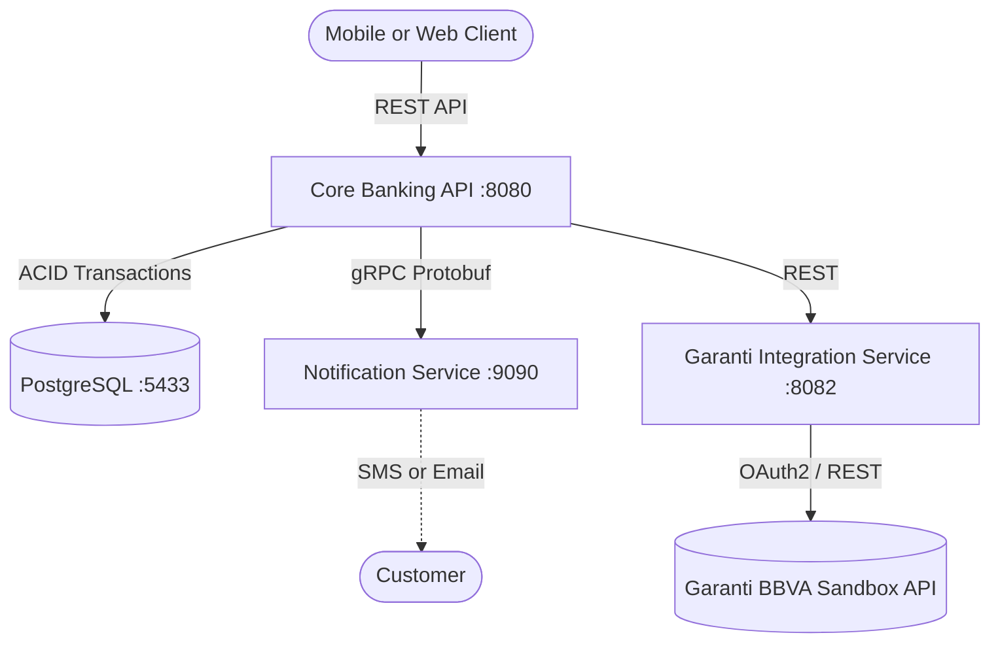

# 🏦 Core Banking System (Microservices & Open Banking)


This repository contains a modern, scalable core banking system built with **Spring Boot 3** and **Java 21**. The project is structured as a **Monorepo** consisting of a main REST API, an asynchronous Notification Service communicating via **gRPC**, and a dedicated External Integration Service for Open Banking features. The entire system is fully containerized using **Docker**.

## 🏗️ System Architecture


## ✨ Key Features & Technical Stack

* **Open Banking Integration:** Seamless connection to external financial APIs (Garanti BBVA Sandbox) via a dedicated integration microservice. Handles external token management, authentication, and complex JSON payload mapping to clean, client-facing DTOs.
* **Dockerized Environment:** One-click deployment for the entire microservices ecosystem and database using `docker-compose`.
* **Clean Architecture:** Strict separation of concerns using DTOs, Mappers, and Fail-Fast Data Validation (`@Valid`).
* **Security First:** Stateless authentication utilizing **Spring Security** and **JWT (JSON Web Tokens)**. Passwords are cryptographically hashed using `BCrypt`.
* **Microservices Communication:** High-performance, low-latency inter-service communication using **gRPC** and **Protocol Buffers (.proto)** alongside standard REST integrations.
* **ACID Compliance:** Guaranteed transactional integrity during money transfers using `@Transactional`.
* **Robust Error Handling:** Centralized API error management using `@RestControllerAdvice` to prevent internal server stack traces from leaking to the client.
* **Unit Testing:** Business logic validated mathematically without database connections using **JUnit 5** and **Mockito**.

## 📂 Monorepo Structure

* `/core-api`: The main banking brain. Handles users, accounts, security, and internal money transfers.
* `/notification-service`: A lightweight gRPC server listening on port 9090 to catch transfer events and simulate customer notifications.
* `/garanti-integration-service`: A dedicated integration microservice acting as a secure bridge between the Core API and the Garanti BBVA Hub for external banking operations.

## 🚀 Getting Started

### Prerequisites
* [Docker](https://www.docker.com/) and Docker Compose (For recommended setup)
* Java 21+ & Maven (For manual setup)

### 🐳 Run with Docker (Recommended & Easiest)
You don't need to install PostgreSQL or Java on your machine. Docker handles everything!
Open a terminal in the root directory and run:
```bash
docker-compose up -d --build
```
That's it! The isolated network will be created, the database will be initialized, and all three microservices will start communicating.

### 🧪 Test the API
1. Navigate to the Swagger UI: `http://localhost:8080/swagger-ui/index.html`
2. Register a new user and log in to obtain your Bearer Token.
3. Test internal features like the transfer endpoint (`POST /api/v1/accounts/transfer`).
4. **Test Open Banking:** Send a request to the loan calculator endpoint (`POST /api/v1/loans/calculate`) to see real-time external bank integration in action.
5. Watch the gRPC notification magic in real-time by checking the Docker logs:
   ```bash
   docker logs -f notification_service
   ```

---
*Developed as a comprehensive engineering simulation showcasing enterprise-level backend practices, microservices communication, and open banking integration.*